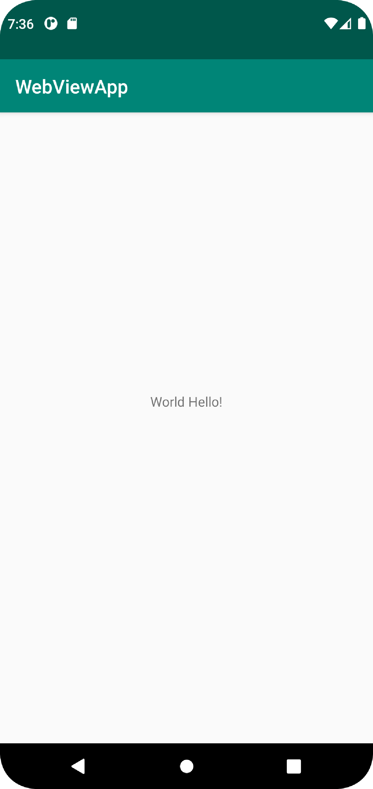

# Rapport

**Skriv din rapport här!**

_Du kan ta bort all text som finns sedan tidigare_.

## Följande grundsyn gäller dugga-svar:

Jag började med att skapa ett nytt skolkonto på github. Tyvärr är med mejl kopplat till min gamla konto vilket innebär jag blev tvungen att skapa nytt mejl specifikt för kursens inlämningar.
Respository blev forkad från länken som angavs av våran lärare. Texten som är centerat i mitten av appen hade först stringen "Hello World!", som jag ändrade till "World Hello!"

